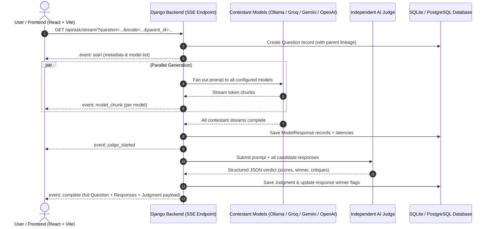

# ⚖️ DEBATE AI — Multi-LLM Comparison Arena

[](https://www.python.org/)
[](https://www.djangoproject.com/)
[](https://react.dev/)
[](https://vitejs.dev/)
[](https://www.docker.com/)
[](LICENSE)

**DEBATE AI** is a real-time side-by-side LLM benchmark and evaluation arena. Ask a single question, stream answers simultaneously from multiple heterogeneous models (local Ollama instances, Google Gemini, OpenAI, Groq, Mistral, Cerebras, OpenRouter), and have an **independent AI Judge** critically score each candidate, declare a winner, analyze consensus, and explain why the losing models fell short.

---

## 📑 Table of Contents

- [Overview](#-overview)
- [Key Features](#-key-features)
- [Architecture & Workflow](#-architecture--workflow)
- [Tech Stack](#-tech-stack)
- [Project Structure](#-project-structure)
- [Prerequisites](#-prerequisites)
- [Quick Start](#-quick-start)
  - [Option A: Docker Compose (Recommended)](#option-a-docker-compose-recommended)
  - [Option B: Local Manual Setup](#option-b-local-manual-setup)
- [Model Configuration](#-model-configuration)
  - [Supported Providers](#supported-providers)
  - [Configuration Presets](#configuration-presets)
- [Prompt Modes](#-prompt-modes)
- [API Reference](#-api-reference)
  - [Authentication](#authentication)
  - [Inference & Streaming](#inference--streaming)
  - [History & Management](#history--management)
- [Diagnostic Utilities](#-diagnostic-utilities)
- [Deployment](#-deployment)
- [Troubleshooting](#-troubleshooting)
- [License](#-license)

---

## 🌟 Overview

Most "multi-agent" comparisons simply query the same model with different system prompts. **DEBATE AI** is built differently:

- **True Model Diversity**: Benchmarks genuinely distinct model architectures and weights running in parallel.
- **Unbiased Independent Arbiter**: The judge is a designated, separate model (`JUDGE_MODEL`) to prevent models from grading their own outputs.
- **Granular Criticisms**: Rather than merely picking a winner, the judge breaks down individual scores (0–100), summarizes performance, explains why each runner-up fell short, and synthesizes overall consensus.
- **Real-Time Parallel SSE Streaming**: Token generation across all contestants streams simultaneously into a multi-column responsive grid with live latency metrics.

---

## ✨ Key Features

- **⚡ Real-Time Parallel Token Streaming**: Server-Sent Events (SSE) stream tokens as they arrive from each provider concurrently via worker threads.
- **🧠 Objective AI Judge**: Rigorous evaluation rubric rating accuracy, clarity, completeness, and edge-case handling.
- **🔄 Multi-Turn Threaded Context**: Ask follow-up questions directly within an active thread (`parent_id`); the conversation history automatically inherits previous questions and winning model answers.
- **🎯 6 Specialized Prompt Modes**: Pre-configured rewrites for Direct, Simple, Summary, Code, Research, and Detailed answers.
- **🔒 Authentication & Guest Mode**: Works out of the box in guest mode or with user accounts (Django Token Auth) for isolated, persistent history.
- **📌 History & Bookmark Management**: Save, inspect, pin, or delete historical comparisons and query sessions.
- **🛡️ Quota & Rate-Limit Resiliency**: Automated detection of HTTP 429 quota limits with live UI countdown timers (`RateLimitNotice`) and non-blocking model skips.
- **📋 Developer-Friendly UI**: Syntax-highlighted Markdown rendering, GitHub Flavored Markdown (GFM) tables, one-click clipboard copy, and stop-generation controls.

---

## 🏗️ Architecture & Workflow



---

## 🛠️ Tech Stack

### Backend
- **Framework**: Django 5.0 + Django REST Framework 3.15
- **Concurrency**: Python `concurrent.futures`, `threading`, and `queue.Queue`
- **Streaming**: Django `StreamingHttpResponse` with Server-Sent Events (`text/event-stream`)
- **Authentication**: DRF Token Authentication + Django User Model
- **Database**: SQLite (default for development) / PostgreSQL (production via `dj-database-url`)
- **Server**: Gunicorn + WhiteNoise static file serving

### Frontend
- **Framework**: React 18 with Vite
- **UI & Icons**: CSS Custom Properties (Dark Cyberpunk Theme), Lucide Icons
- **Markdown**: `react-markdown` + `remark-gfm`
- **Network**: Native `EventSource` (SSE) and `fetch` API

### Infrastructure & Deployment
- **Containers**: Multi-stage Dockerfiles (`python:3.13-slim` & `nginx:alpine`)
- **Orchestration**: Docker Compose
- **Platform Support**: Localhost, Docker, Render, Vercel

---

## 📁 Project Structure

```
DEBATE_AI/
├── docker-compose.yml              # Container orchestration for frontend & backend
├── .python-version                 # Python runtime version pinning
├── README.md                       # Project documentation
│
├── backend/
│   ├── backend/                    # Django project configuration
│   │   ├── asgi.py
│   │   ├── settings.py             # App settings, CORS, Database, Logging
│   │   ├── urls.py                 # Top-level URL routing
│   │   └── wsgi.py
│   ├── core/                       # Core application
│   │   ├── migrations/             # Database migration history
│   │   ├── services/
│   │   │   ├── providers.py        # Pluggable LLM provider factory & streaming clients
│   │   │   └── judge.py            # AI Arbiter evaluation engine & JSON parser
│   │   ├── admin.py                # Django admin registration
│   │   ├── models.py               # Question, ModelResponse, Judgment models
│   │   ├── serializers.py          # DRF Serializers
│   │   ├── urls.py                 # API endpoints definition
│   │   └── views.py                # SSE streaming, auth, and history handlers
│   ├── check_contestants.py        # CLI diagnostic: test contestant connections
│   ├── check_judge.py              # CLI diagnostic: test judge model responsiveness
│   ├── Dockerfile                  # Production backend container build
│   ├── requirements.txt            # Python dependencies
│   ├── .env.example                # Backend environment variable template
│   └── manage.py
│
└── frontend/
    ├── src/
    │   ├── components/
    │   │   ├── AuthModal.jsx       # Login & registration dialog
    │   │   ├── HistoryDrawer.jsx   # History sidebar with pin, delete, clear actions
    │   │   ├── JudgePanel.jsx      # Arbiter breakdown, scores, and consensus view
    │   │   ├── RateLimitNotice.jsx # Cooldown timer indicator
    │   │   └── ResponseCard.jsx    # Model answer card with Markdown & copy controls
    │   ├── api.js                  # REST & EventSource client wrapper
    │   ├── modes.js                # Prompt modifier presets (Direct, Code, etc.)
    │   ├── App.jsx                 # Main comparison grid & state orchestration
    │   ├── App.css                 # Responsive stylesheet & design tokens
    │   ├── index.css
    │   └── main.jsx
    ├── Dockerfile                  # Multi-stage production build with Nginx
    ├── nginx.conf                  # Nginx reverse proxy & SPA fallback configuration
    ├── package.json                # Frontend package dependencies & scripts
    ├── vite.config.js              # Vite bundler configuration
    └── .env.example                # Frontend environment variable template
```

---

## 📦 Prerequisites

Before running the project locally, ensure you have:

- **Python**: `3.11` or higher (`3.13` recommended)
- **Node.js**: `18.x` or higher and `npm`
- **Ollama** *(Optional)*: If running local offline models ([Download Ollama](https://ollama.com/))
- **Docker & Docker Compose** *(Optional)*: If using containerized deployment

---

## 🚀 Quick Start

### Option A: Docker Compose (Recommended)

1. **Clone the repository**:
   ```bash
   git clone https://github.com/Skanda001/Debate_AI.git
   cd Debate_AI
   ```

2. **Configure backend environment**:
   ```bash
   # Copy sample environment configuration
   cp backend/.env.example backend/.env
   ```
   Edit `backend/.env` and add your API keys (e.g., `GROQ_API_KEY`, `GEMINI_API_KEY`).

3. **Launch containers**:
   ```bash
   docker-compose up --build
   ```

4. **Access the application**:
   - **Frontend UI**: [http://localhost:8080](http://localhost:8080)
   - **Backend API**: [http://localhost:8000/api/](http://localhost:8000/api/)

---

### Option B: Local Manual Setup

#### 1. Backend Setup

```bash
cd backend

# Create and activate virtual environment
# On macOS / Linux:
python3 -m venv venv
source venv/bin/activate

# On Windows (PowerShell):
python -m venv venv
.\venv\Scripts\Activate.ps1

# Install dependencies
pip install -r requirements.txt

# Configure environment variables
cp .env.example .env
```

Open `backend/.env` and supply your API keys and model configurations.

Run database migrations and start the Django development server:
```bash
python manage.py migrate
python manage.py runserver 127.0.0.1:8000
```

The backend is now running at `http://127.0.0.1:8000/api/`.

#### 2. Frontend Setup

In a new terminal window:
```bash
cd frontend

# Install npm packages
npm install

# Copy environment file
cp .env.example .env

# Start Vite dev server
npm run dev
```

Visit the frontend at [http://localhost:5173](http://localhost:5173).

---

## ⚙️ Model Configuration

The arena is configured entirely via environment variables in `backend/.env`.

### Supported Providers

| Provider Prefix | Format Syntax | Required Environment Variables | Example |
| :--- | :--- | :--- | :--- |
| **`ollama`** | `ollama:<model>` | `OLLAMA_BASE_URL` *(defaults to `http://localhost:11434`)* | `ollama:llama3.2:1b` |
| **`gemini`** | `gemini:<model>` | `GEMINI_API_KEY` | `gemini:gemini-2.5-flash` |
| **`groq`** | `groq:<model>` | `GROQ_API_KEY` | `groq:openai/gpt-oss-120b` |
| **`openai`** | `openai:<model>` | `OPENAI_API_KEY`, `OPENAI_BASE_URL` *(optional)* | `openai:gpt-4o-mini` |
| **`openrouter`**| `openrouter:<model>` | `OPENROUTER_API_KEY` | `openrouter:openrouter/free` |
| **`cerebras`** | `cerebras:<model>` | `CEREBRAS_API_KEY` | `cerebras:llama3.1-8b` |
| **`mistral`** | `mistral:<model>` | `MISTRAL_API_KEY` | `mistral:mistral-small-latest` |

### Configuration Presets

#### 1. High-Speed Cloud Setup (Groq + Gemini)
```env
CONTESTANTS=groq:openai/gpt-oss-120b,gemini:gemini-2.5-flash,groq:openai/gpt-oss-20b
JUDGE_MODEL=gemini:gemini-2.5-flash

GROQ_API_KEY=gsk_your_groq_api_key
GEMINI_API_KEY=your_gemini_api_key
```

#### 2. Fully Local Setup (100% Free / Offline with Ollama)
Pull models locally:
```bash
ollama pull llama3.2:1b
ollama pull qwen2.5:3b
ollama pull phi3:mini
```
Configure in `backend/.env`:
```env
CONTESTANTS=ollama:llama3.2:1b,ollama:qwen2.5:3b
JUDGE_MODEL=ollama:phi3:mini
OLLAMA_BASE_URL=http://localhost:11434
```

#### 3. Hybrid Arena (Local + Commercial APIs)
```env
CONTESTANTS=ollama:llama3.2:1b,gemini:gemini-2.5-flash,openai:gpt-4o-mini
JUDGE_MODEL=gemini:gemini-2.5-flash

GEMINI_API_KEY=your_gemini_api_key
OPENAI_API_KEY=your_openai_api_key
```

> [!TIP]
> Any contestant model that fails to initialize (e.g. missing API key or offline Ollama server) is skipped automatically without crashing the comparison.

---

## 🎯 Prompt Modes

Select specialized output modes directly above the input prompt to adjust the evaluation criteria:

| Mode | Icon | Purpose | Prompt Transformation |
| :--- | :---: | :--- | :--- |
| **Direct** | 💬 | Standard Q&A | Passes the original question unchanged. |
| **Simple** | 🪶 | Plain English | Restricts answers to ~100 words, plain vocabulary, and no unexplained jargon. |
| **Summary** | 📝 | Executive overview | Requests a max 5-bullet summary followed by a single `TL;DR` line. |
| **Code** | 💻 | Technical / Dev | Enforces runnable fenced code blocks, comments, and 2–3 pitfall warnings. |
| **Research**| 🔬 | In-depth analysis | Structures output into `Background → Key Findings → Open Questions` with source citations. |
| **Detailed**| 📚 | Comprehensive | Requests a structured 400–600 word deep dive covering edge cases. |

---

## 📡 API Reference

Base URL: `http://127.0.0.1:8000/api`

### Authentication

| Endpoint | Method | Auth | Description |
| :--- | :--- | :--- | :--- |
| `/auth/register/` | `POST` | None | Register new user. Returns user details & token. |
| `/auth/login/` | `POST` | None | Authenticate with username/password or email. |
| `/auth/me/` | `GET` | Token | Retrieve profile information for the authenticated user. |
| `/auth/logout/` | `POST` | Token | Invalidate and revoke current session token. |

### Inference & Streaming

#### `GET /api/ask/stream/`
Streams token generation from all contestant models in parallel, followed by the judge's verdict via **Server-Sent Events (SSE)**.

**Query Parameters:**
- `question` *(string, required)*: The input prompt.
- `token` *(string, optional)*: User auth token.
- `parent_id` *(integer, optional)*: ID of the parent question for multi-turn conversational context.

**SSE Event Types:**
```text
event: start
data: {"question_id": 12, "parent_id": null, "question": "...", "models": [{"model_id": "gemini:...", "display_name": "..."}]}

event: model_started
data: {"model_id": "gemini:...", "display_name": "..."}

event: model_chunk
data: {"model_id": "gemini:...", "chunk": "..."}

event: model_finished
data: {"id": 45, "model_id": "...", "response": "...", "error": null, "latency_ms": 1420}

event: judge_started
data: {}

event: complete
data: {"result": { ...full Question, ModelResponse[], Judgment serializer payload... }}
```

#### `POST /api/ask/`
Synchronous fallback endpoint executing generation and evaluation before returning complete JSON.

### History & Management

| Endpoint | Method | Auth | Description |
| :--- | :--- | :--- | :--- |
| `/history/` | `GET` | Optional | List recent comparisons (filtered to current user or guest). |
| `/history/<id>/` | `GET` | Optional | Retrieve full details, candidate responses, and judgment for an ID. |
| `/history/<id>/pin/` | `PATCH` | Optional | Toggle pinned status on a question comparison. |
| `/history/<id>/delete/` | `DELETE` | Optional | Delete a single comparison thread. |
| `/history/clear/` | `DELETE` | Optional | Clear all comparisons for current user / guest session. |

---

## 🧪 Diagnostic Utilities

Two built-in CLI scripts allow you to test your configuration before launching the web UI:

### 1. Check Contestant Availability
Verifies that all models in `CONTESTANTS` are reachable and have valid API credentials:
```bash
cd backend
python check_contestants.py
```
*Sample Output:*
```text
CONTESTANTS raw: groq:openai/gpt-oss-120b,gemini:gemini-2.5-flash
✅ groq:openai/gpt-oss-120b  →  groq:openai/gpt-oss-120b  (openai/gpt-oss-120b)
✅ gemini:gemini-2.5-flash   →  gemini:gemini-2.5-flash   (Gemini gemini-2.5-flash)
Count: 2
```

### 2. Check Judge Model
Verifies the designated `JUDGE_MODEL` credentials and performs a quick test generation:
```bash
cd backend
python check_judge.py
```

---

## 🚢 Deployment

### Production Docker Build

Run frontend and backend containers together behind Nginx:
```bash
docker-compose -f docker-compose.yml up --build -d
```

### Deploying to Render
1. **Backend**:
   - Create a **Web Service** pointing to the `backend/` directory.
   - Set Build Command: `pip install -r requirements.txt && python manage.py migrate && python manage.py collectstatic --noinput`
   - Set Start Command: `gunicorn backend.wsgi:application --bind 0.0.0.0:$PORT`
   - Set environment variables (`DJANGO_SECRET_KEY`, `CONTESTANTS`, `JUDGE_MODEL`, API keys).
2. **Frontend**:
   - Create a **Static Site** pointing to `frontend/`.
   - Build Command: `npm install && npm run build`
   - Publish Directory: `dist`
   - Add environment variable `VITE_API_BASE=https://<your-backend>.onrender.com/api`

---

## ❓ Troubleshooting

### Ollama Connection Errors (`Connection refused`)
- Ensure the Ollama daemon is actively running: `ollama serve`.
- If Ollama is running inside Docker or on a separate host, set `OLLAMA_BASE_URL=http://host.docker.internal:11434` or your machine's local IP.

### HTTP 429 / Quota Errors
- Free tiers on hosted providers (Gemini, Groq, OpenRouter) frequently enforce RPM / RPD limits.
- The UI will automatically display a **Rate Limit Notice** with a live countdown if a model returns a retry delay.
- Alternatively, mix in local Ollama models which have zero quota constraints.

### CORS Errors in Browser
- If the frontend cannot reach the backend, verify `FRONTEND_ORIGIN` in `backend/.env` matches your Vite development port (usually `http://localhost:5173` or `http://localhost:8080`).
- When `DEBUG=True`, CORS allows all origins by default.

---

## 📄 License

This project is licensed under the [MIT License](LICENSE).
